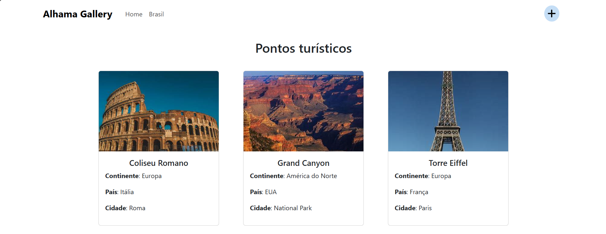

# Alhama Gallery

Bem-vindo ao **Alhama Gallery**, uma plataforma online dedicada a exibir uma galeria global de paisagens icônicas e pontos turísticos de diversos países. Explore monumentos, lugares históricos e belezas naturais de todo o mundo, com um foco especial em locais turísticos brasileiros.



## 🌍 Funcionalidades Principais

### 🔥 Galeria de Imagens Global

- **Exploração de Paisagens**: Veja imagens incríveis de pontos turísticos e paisagens ao redor do mundo.
- **Detalhamento Geográfico**: Cada imagem está associada a informações detalhadas sobre o continente, país e cidade.

### 🇧🇷 Página Exclusiva para o Brasil

- Uma seção dedicada **exclusivamente a paisagens brasileiras**, permitindo que os usuários explorem os principais pontos turísticos do Brasil.

### 🔒 Integração com Firebase Firestore

- Utilizamos o **Firebase Firestore** para armazenar e gerenciar as informações das imagens e seus metadados.
- As imagens são carregadas diretamente do Firestore em tempo real, proporcionando uma atualização dinâmica da galeria.

## 🚀 Hospedagem

O projeto está hospedado na **Vercel**, permitindo uma entrega rápida e estável da aplicação, com deploy contínuo.

### 🌐 [Visite a aplicação ao vivo](https://alhama-gallery.vercel.app/)

---

## ⚙️ Tecnologias Utilizadas


[](https://fontawesome.com/)

### Principais Tecnologias:

- **React**: Framework moderno para construir interfaces de usuário dinâmicas e responsivas.
- **Firebase Firestore**: Banco de dados NoSQL usado para armazenar e gerenciar as imagens e metadados.
- **Vercel**: Hospedagem rápida e eficiente com deploy automatizado.
- **Font Awesome**: Ícones bonitos e intuitivos para melhorar a usabilidade da interface.

---

## 🛠️ Como Executar o Projeto Localmente

1. **Clone o repositório**:

   ```bash
   git clone https://github.com/seu-usuario/alhama-gallery.git

   ```

2. **Instale as dependências**:

   ```bash
   npm install

   ```

3. **Configuração do Firebase Firestore**:
   - Crie um projeto no Firebase.
   - No console do Firebase, crie um banco de dados Firestore e cole a configuração do projeto no arquivo firestore.config.js, ou crie um arquivo .env.local com as seguintes variáveis de ambiente:
    ```bash
    REACT_APP_FIREBASE_API_KEY=your_api_key
    REACT_APP_FIREBASE_AUTH_DOMAIN=your_project_id.firebaseapp.com
    REACT_APP_FIREBASE_PROJECT_ID=your_project_id
    REACT_APP_FIREBASE_STORAGE_BUCKET=your_project_id.appspot.com
    REACT_APP_FIREBASE_MESSAGING_SENDER_ID=your_sender_id
    REACT_APP_FIREBASE_APP_ID=your_app_id

4. **Inicie o servidor de desenvolvimento**:
    ```npm start
    npm start

5. **Acesse a aplicação no navegador**:
    - http://localhost:3000

## 🤝 Como Contribuir

Contribuições são sempre bem-vindas! Siga estas etapas para colaborar com o projeto:

1. Faça um **fork** deste repositório.
2. Crie um novo branch para suas mudanças:
    ```bash
    git checkout -b feature/nova-funcionalidade
3. Implemente suas alterações e adicione commits com descrições detalhadas:
    ```bash
    git add .
    git commit -m "Descrição detalhada da sua mudança"
4. Envie o branch para o seu fork:
    ```bash
    git push origin feature/nova-funcionalidade
5. Crie um Pull Request no repositório original explicando as mudanças propostas.

Para mais informações, veja nosso arquivo CONTRIBUTING.md.

## Autores

Este projeto é mantido por:

    [@AllanSmithll](https://www.github.com/AllanSmithll)
    [@HanielCostaDaSilva](https://www.github.com/HanielCostaDaSilva)
    [@Immarcio](https://www.github.com/Immarcio)

Sinta-se à vontade para entrar em contato para discussões, sugestões ou colaborações!

## Licença

Este projeto está licenciado sob a [Licença MIT](/LICENSE), o que significa que você pode utilizar, modificar e distribuir o código livremente.
